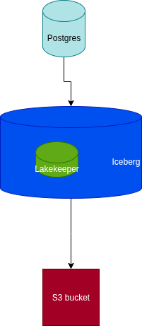

# “PostgreSQL ➜ OLake ➜ Iceberg ➜ MinIO ➜ Spark Data Pipeline” Demo

This repository spins up an end-to-end **lakehouse** on your local system.  

You will:
1. Populate a demo table in PostgreSQL.  
2. Sync that table into **Apache Iceberg** files on MinIO using the **OLake** connector.  
3. Query the Iceberg table from **Apache Spark**.

The flow looks like this:




## TLDR;

```bash
# 1. Build & start the stack
docker compose up --build -d

# 2. Discover streams in Postgres
**discover** command       # or run the discover command below

# 3. Sync Postgres → Iceberg (files land in MinIO)
**sync**  command            # or run the sync command below

# 4. Open Spark SQL shell
spark-sql           # enters spark-sql with Iceberg catalog pre-wired

# 5. Query the lakehouse
SELECT * FROM olake_iceberg.orders LIMIT 5;
```

## 1. Services

| Container | Why it exists |
|-----------|---------------|
| **primary_postgres** | Source OLTP database with `orders` table (logical replication enabled). |
| **data_loader** | One-shot job that seeds 20 demo rows and creates a replication slot. |
| **lakekeeper** | Implements the **Iceberg REST Catalog** (metadata service). |
| **iceberg-postgres** | Postgres instance that stores Lakekeeper’s metadata tables. |
| **minio** | Local, S3-compatible object store that holds Iceberg data/manifest files. |
| **mc** | Helper that boots MinIO, creates the `warehouse` bucket. |
| **spark-iceberg** | Spark 3.5 image with Iceberg JARs; used for interactive queries. |
| **hive-metastore** | Optional Hive service for engines that still expect HMS. |

All containers share the `iceberg_net` network, so they can reach each other by service name (e.g., `http://lakekeeper:8181`).

## 2. Build & Run

```bash
git clone https://github.com/your-org/olake_postgres_demo.git
cd olake_postgres_demo
docker compose up --build -d
```

Check health:

```bash
docker compose ps
```

You should see something like this:

```
NAME                STATE   HEALTH
primary_postgres    ...     healthy
lakekeeper          ...     healthy
minio               ...     running
spark-iceberg       ...     running
```

## 3. Seed the source database

`data_loader` runs automatically and inserts rows:

```bash
docker exec -it primary_postgres psql -U main -d main -c \
"SELECT COUNT(*) FROM orders;"
```

Expect `20`.

## 4. Discover and Sync with OLake

### 4.1 Discover streams

```bash
docker run --pull=always  \
  --network olake_postgres_iceberg_net \
  -v "$(pwd):/mnt/config" \
  olakego/source-postgres:latest \
  discover \
  --config /mnt/config/source.json
```


### 4.2 Sync to Iceberg

```bash
docker run --pull=always  \
  --network olake_postgres_iceberg_net \
  -v "$(pwd):/mnt/config" \
  olakego/source-postgres:latest \
  sync \
  --config /mnt/config/source.json \
  --catalog /mnt/config/streams.json \
  --destination /mnt/config/destination.json
```

Behind the scenes OLake:

1. Reads PostgreSQL via Debezium.
2. Converts rows to Parquet.
3. Writes files to `s3a://warehouse/olake_iceberg/orders/…` on MinIO.
4. Registers metadata in Lakekeeper.

## 5. Query with Spark

```bash
# open Spark shell inside the container
docker exec -it spark-iceberg spark-sql
```

Spark is pre-configured (`spark-defaults.conf`) with three catalogs:

```
USE CATALOG rest;           -- Lakekeeper REST catalog
SHOW TABLES IN olake_iceberg;
DESCRIBE olake_iceberg.orders;
SELECT * FROM olake_iceberg.orders LIMIT 10;
```

Try time-travel:

```sql
CALL olake_iceberg.system.snapshots('orders');

-- pick a snapshot_id, then:
SELECT COUNT(*) FROM olake_iceberg.orders
  VERSION AS OF ;
```

## 6. Web UIs

| URL | What you’ll see |
|-----|-----------------|
| http://localhost:9001 | MinIO console (user **admin** / **password**). |
| http://localhost:8181/ui | Lakekeeper web UI |
| http://localhost:8088 | Spark History / Web UI. |
| http://localhost:8888 | Jupyter notebook on Spark driver |

## 7. Tear down

```bash
docker compose down -v     # stops containers & removes volumes
```

